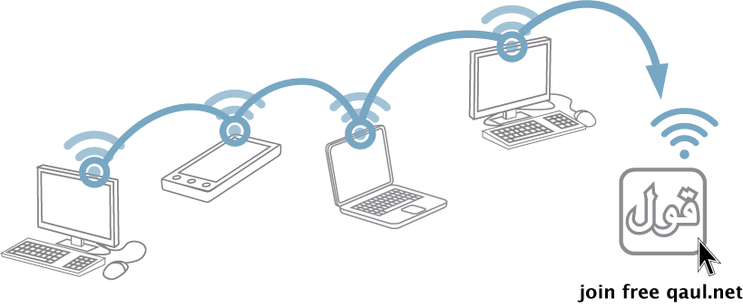

# qaul.net – قول 
## Internet Independent Wireless Mesh Communication App

**qaul** is a decentralised networking project, aiming to create 
a peer2peer wireless mesh communication app for **messaging**, 
**filesharing**, and **voice calls**.

The project currently undergoes a complete rewrite in [Rust](https://rustlang.org).
In order to be able to run on unpriviledged mobile platforms qaul.net
implements **decentralised routing protocols** and utilities entirely
in userspace.
You are warmly invited to be part of this endeavour!

The old version 1.0 is in the independent [release-1.0.0](https://git.open-communication.net/qaul/qaul.net/-/tree/release-1.0.0) branch of this repository.

## Components

Components have additional information in their respective README files.

| Component   | Description      |
|-------------|------------------|
| [clients]   | qaul.net end-user applications for various platforms |
| [docs]      | Manuals (for both users and developers), and tools to build and deploy documentation |
| [emberweb]  | Cross-platform web interface bundled in with various user clients |
| [libqaul]   | Core library of the qaul.net ecosystem.  Provides networking abstractions, user management and discovery |
| [licenses]  | Set of license texts that are in use in this repository |
| [netmods]   | Platform-specific networking interface drivers |
| [ratman]    | A decentralised and modular userspace frame router |
| [tests]     | Integrated test suite for various components.  Most of the code also has inline tests |
| [utils]     | Set of utilities that are used in various places and don't fit anywhere else |

[clients]: ./clients
[docs]: ./docs
[emberweb]: ./emberweb
[libqaul]: ./libqaul
[licenses]: ./licenses
[netmods]: ./netmods
[ratman]: ./ratman
[tests]: ./tests
[utils]: ./utils

## Overview

qaul.net aims to solve this issue by creating decentralised circuits
between devices directly. These direct device-to-device connections can
be imperfect and unstable.  qaul.net's routing approach takes these
issues into account by caching undelivered messages, and carrying them
towards their destination until the recepient comes back online.

Routing in a qaul.net network is done via a user's ed25519 public keys,
creating a 32 byte large address space.  Connecting devices together happens
via channel-specific drivers (for example the tcp internet overlay). Therefore
when creating a circuit, roaming between different connection types is normal,
and no single technology has to work on all possible devices.

To learn more about the technical side of qaul.net, check out the
[qaul.net manual].

## qaul.net Manual

To join the development of qaul.net, read the qaul.net
Social processes, code, and design guidelines are outlined in the
[contributor manual].  

[qaul.net manual]: https://docs.qaul.net/manual

## License

qaul.net is free software licensed under the
[GNU Affero General Public License version 3](licenses/agpl-3.0.md) or
later.

**Additional Permissions:** For Submission to the Apple App Store:

Provided that you are otherwise in compliance with the AGPLv3 for each
covered work you convey (including without limitation making the
Corresponding Source available in compliance with Section 6 of the
AGPLv3), the qaul.net developers also grant you the additional
permission to convey through the Apple App Store non-source executable
versions of the Program as incorporated into each applicable covered
work as Executable Versions only under the Mozilla Public License
version 2.0.

A copy of both the AGPL-3.0 and MPL-2.0 license texts are included in
this repository, along other external licenses for third-party code,
and can be found in the [licenses](licenses) directory.
